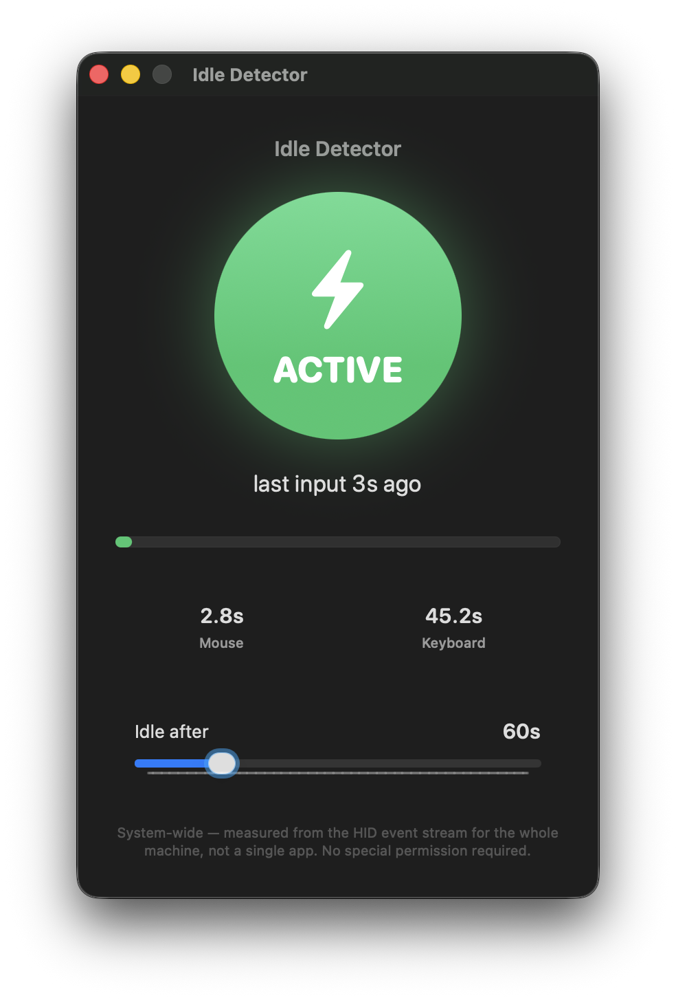

# macos-idle-detector

**Is the human at the keyboard, or has the machine been sitting untouched?**
A tiny SwiftUI macOS app that answers that question at a glance — and a readable,
end-to-end reference for *how* you detect user idle time on macOS.

<p align="center">
  
</p>

---

## What it does

- Reads the system-wide human-input idle time straight from the HID event stream.
- Shows a big **ACTIVE** (green) / **IDLE** (amber) dial that flips the instant you touch —
  or stop touching — the mouse or keyboard.
- Breaks idle time down per device (mouse vs. keyboard), counts the seconds since your last
  input, and fills a progress bar as you approach the threshold.
- Lets you set the idle threshold (2–300s) live with a slider.

It's a proof of concept — small enough to read in one sitting, useful enough to crib from.

## How it works

There's no framework magic here — just one Core Graphics call per event type:

```swift
let idle = CGEventSource.secondsSinceLastEventType(.combinedSessionState,
                                                   eventType: .mouseMoved)
```

`secondsSinceLastEventType` is *per event type*, so the app takes the minimum across all the
mouse-class events and all the keyboard-class events, then `idle = min(mouse, keyboard)`. A
`@MainActor @Observable` model polls that 10×/second; SwiftUI does the rest.

## Scope: it's system-wide, on purpose

Idle time is measured for the **whole computer**, not a single app — and that isn't a
limitation that can be tuned away. macOS routes an input event to an app only *after* the
window server decides who's frontmost and where the cursor is; the idle counter sits
*upstream* of that routing. So it can faithfully answer **"is a human touching this machine
right now?"** but never **"…and into which app?"** There's no per-app equivalent short of
installing a global event tap.

> **Heads up — synthetic input counts too.** A `CGEvent` posted by automation resets these
> same counters; to the HID layer, an injected click is indistinguishable from a human one.
> Telling "the user is back" apart from "my own automation just clicked" means tracking your
> injected events separately. That's deliberately out of scope for this PoC.

## Permissions

**None.** Reading idle time needs no Accessibility grant or any other TCC permission — the
app just works on launch.

## Build & run

Requires [XcodeGen](https://github.com/yonaskolb/XcodeGen) (`brew install xcodegen`) and
macOS 14+.

```sh
git clone https://github.com/drewster99/macos-idle-detector.git
cd macos-idle-detector
xcodegen generate          # produces IdleDetector.xcodeproj from project.yml
open IdleDetector.xcodeproj
```

Build & run the `IdleDetector` scheme. The `.xcodeproj` is intentionally gitignored — it's
generated from `project.yml`, which is the source of truth.

## Project layout

```
macos-idle-detector/
├── project.yml                 # XcodeGen project definition
├── screenshot.png
└── IdleDetector/
    ├── IdleDetectorApp.swift   # @main; owns the IdleMonitor
    ├── IdleMonitor.swift       # the idle detection — read this first
    ├── ContentView.swift       # the dial, breakdown, and threshold UI
    └── AppStyling.swift        # centralized colors & fonts
```

## License

MIT — see [LICENSE.md](LICENSE.md).

Copyright © 2026 Nuclear Cyborg Corp.
Written by Andrew Benson

- Email — db@nuclearcyborg.com
- Twitter/X — [@TheDrewBenson](https://x.com/TheDrewBenson)
- GitHub — [drewster99](https://github.com/drewster99)
